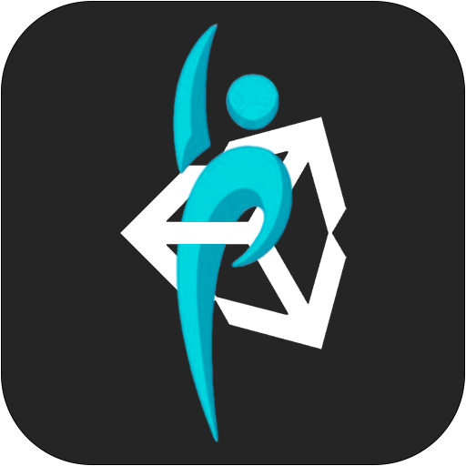

<div id="top"></div>

<!-- PROJECT LOGO -->
<br />
<div align="center">
    

  <h2 align="center">Metahuman in AR</h2>

  <p align="center">
    Animation of a metahuman in an augmented reality application
    <br>
    <br>
  </p>
</div>


<!-- TABLE OF CONTENTS -->
<details open>
  <summary>Table of Contents</summary>
  <ol>
    <li>
      <a href="#about-the-project">About the project</a>
      <ul>
        <li><a href="#workflow">Workflow</a></li>
      </ul>
    </li>
    <li><a href="#getting-started-man_technologist">Getting Started</a></li>
    <li><a href="#animation-of-the-metahuman-man_dancing">Animation of the metahuman</a></li>
    <li><a href="#ar-implementation-goggles">AR implementation</a></li>
    <li><a href="#usage-iphone">Usage</a></li>
    <li><a href="#demo">Demo</a></li>
    <li><a href="#further-works">Further works</a></li>
    <li><a href="#license">License</a></li>
    <li><a href="#contact">Contacts</a></li>
    <li><a href="#acknowledgments">Acknowledgments</a></li>
    <li><a href="#disclaimer">Disclaimer</a></li>
  </ol>
</details>

<!-- ABOUT THE PROJECT -->
## About the project

**The project aims to animate a metahuman in an augmented reality application.**

This is the repository for the project of the course Computer Vision 2021-2022 @ UniTN  made by Laiti Francesco and Lobba Davide.

The game engine used is [Unity](https://unity.com) version 2021.3 and the application was tested on iOS and Android platforms.
The 3D model for the humanoid used in this project is the [SMPL-X](https://smpl-x.is.tue.mpg.de/).\
For the animation of the metahuman, we used the [OptiTrack](https://optitrack.com/) system available at the CIMI Laboratory to track body movements. 

We proposed a scenario where the metahuman is a personal trainer. The exercises are 4: warm-up, first training phase, second training phase and stretching.
<!-- WORKFLOW -->
### Workflow


<!-- GETTING STARTED -->
## Getting Started :man_technologist:

1. Install *Unity* version 2021.3 
   
   NOTE: a different version is not guaranteed to work properly
2. Clone this repository
3. Open the scene [cv_2022](Assets/Scene/cv_2022.unity)
4. Ensure that you have installed ARCore or ARKit packages in Unity
   ```sh
   Window > Package Manager > install AR Foundation, ARCore XR, ARKit XR
   ```
5. Go to 
    ```sh
    Edit > Project Settings > XR-Plugin Management
    ```
    check one of the boxes of ARKit or ARCore
6. Go to 
    ```sh
    File > Build Settings > choose your platform > switch platform
    ```
7.  Build and run the project by using the command 
    ```sh
    File > Build And Run
    ```
8.  Now you are ready to deploy the application on your device! :rocket:

Otherwise, if you would like to test the scene in the Unity simulator, you have to adapt the code and the scene to work with the Unity simulator. 

NOTE: 
- For the iOS world, ARKit requires iOS 11.0 or later and an iOS device with an A9 or later processor. You also need the software XCode (only available on macOS) :cry:
- For the Android world, you have to check if your device supports ARCore. Check it on https://developers.google.com/ar/devices
- The application was tested on an iPhone XS with iOS 15.5


<!-- ANIMATE THE METAHUMAN-->
## Animation of the metahuman :man_dancing:

For the animation of the metahuman we used a JSON file structured as follows:
```
.
├── Frame                # Number of the frame
│   ├── Trans            # Root translation
│   ├── Fullpose         # List of coordinates x,y,z for each joint
│         └── Data       # Coordinates of one joint
└── ...
```

We created the c3d file using the [OptiTrack wear](https://optitrack.com/accessories/wear/) and a system of [cameras](https://optitrack.com/cameras/) and [markers](https://optitrack.com/accessories/markers/), in particular we used the application [Motive](https://optitrack.com/software/motive/) to record movements.\
Then, in order to convert the c3d file into a JSON file, we used [Soma](https://github.com/nghorbani/soma) and [MoSh++](https://github.com/nghorbani/moshpp).

Later, we read the JSON file in the [SMPL-X](Assets/Scripts/SMPLX/SMPLX.cs) script and we animated the metahuman.\
Successively, we implemented the animation of the metahuman which starts when we are close to it. We chose 4 meters, but you can change it in the [SMPL-X](Assets/Scripts/SMPLX/SMPLX.cs) script.


<!-- AR IMPLEMENTATION -->
## AR Implementation :goggles:
We tested the whole project in the Unity simulator to detect any errors or bugs before switching to AR.

For the AR implementation, we used the AR Foundation Kit provided by Unity. In particular, we created an AR session and an AR camera. When you start the application, the main camera of the scene will be the camera of your smartphone.

Later, we implemented the ground plane. When you start the application, the camera will detect planes in the room and you can choose where to instantiate the metahuman. It is important to say that the metahuman is a child of the ground plane, so its position depends on the ground plane.


<!-- USAGE EXAMPLES -->
## Usage :iphone:

1. Open the application. The device scans your environment and it tries to find a ground plane where the metahuman will be instantiated
2. Select one of the four modes available
3. Place the metahuman wherever you want, just tap on the display :point_up_2:
4. The animation is triggered when the camera is near the metahuman, so if you are far from it, go closer to the object. At the top of the screen you can see the distance from the metahuman.
5. Enjoy the animation! :zap:


<!-- DEMO -->
## Demo
We provide two GIFs to show how the app looks like:
<p align="center">
  
&nbsp; &nbsp; &nbsp; &nbsp;
  
</p>

In the *first* GIF, we instantiate the SMPLX in a certain position and we animate it when we are close to the object.

In the *second* GIF we do the same steps as before but when we go far from the object (more than 4 meters), the animation correctly stops.

<!-- CONCLUSIONS -->
## Further works
- [ ] Implement more animations
- [ ] Add voice to the SMPLX
- [ ] Consider a more high realistic texture
- [ ] Migrate the project to Unreal Engine


<!-- LICENSE -->
## License

Distributed under the MIT License. See `LICENSE` for more information.

<!-- CONTACT -->
## Contact

Francesco Laiti - [Github](https://github.com/laitifranz/) - [Linkedin](https://www.linkedin.com/in/francesco-laiti/) - [UniTN email](mailto:francesco.laiti@studenti.unitn.it) | Davide Lobba - [Github](https://github.com/davidelobba/) - [Linkedin](https://www.linkedin.com/in/davide-lobba-659739185) - [UniTN email](mailto:davide.lobba@studenti.unitn.it)

## Disclaimer

This project is only for educational purposes.

## Acknowledgments

We thank the MMLab and the University of Trento for the opportunity to use the OptiTrack system available at the [CIMI Laboratory](https://www.cimil.disi.unitn.it).

We used the 3D model human SMPL-X available at https://smpl-x.is.tue.mpg.de/


<p align="right">(<a href="#top">back to top</a>)</p>

